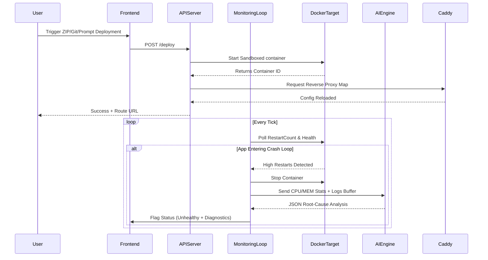

# SkyDeploy Architecture

## Overview
SkyDeploy is a robust Mini Platform-as-a-Service (PaaS) built to streamline the process of taking local code and launching it into isolated Docker containers on a host machine. It features native Git integration, direct ZIP deployments, and a built-in AI Development mode capable of autonomously generating and hosting applications. 

As of version 4.0, the architecture incorporates deeply integrated Autonomous Monitoring, Container Security Sandbox policies, and an AI-driven Diagnostic module.

## High-Level Components

### 1. Client (React/Vite)
- A modern, responsive dashboard offering developers full UX control.
- Features real-time SSE (Server-Sent Events) container log streaming.
- **Key Modules:** Dashboard, AppDetails, Deploy Modal, AI Generation Playground, Landing, Documentation.

### 2. API-Server (Node.js/Express)
The core orchestrator handling all heavy-lifting:
- **Ports:** Runs API on 4000. Uses a unified Docker network (`skydeploy-net`) for internal routing, avoiding host port exhaustion.
- **Database:** SQLite (managed via Sequelize), storing User credentials and Application metrics.
- **Routing Engine & Load Balancer:** Maintains an in-memory replica state registry. Interacts with the Caddy Reverse Proxy and local HTTP Proxy asynchronously to map traffic via native Docker DNS (`appname-1:3000`) and enforce round-robin load balancing.
- **Native Orchestration (`replication.js`):** Interacts natively with the Docker Engine Socket (`/var/run/docker.sock`) over HTTP to spawn replicas, continuously check their health, and execute zero-downtime rolling deployments without K8s or Swarm overhead.
- **Events & Webhooks:** Handles automated ZIP extraction, Git cloning, and issues deployment email notifications via Nodemailer.

### 3. Build-Server Environments (Docker Engine)
- **Node Environment (`skydeploy-build-server`):** Used for React and Express. Clones code/extracts ZIPs, runs `npm install`, builds standard static applications, and serves them.
- **Python Environment (`skydeploy-build-python`):** Dedicated execution engine for Python workloads (Flask, FastAPI, Django, Streamlit) utilizing `requirements.txt` pipelines.
- **Security Sandboxing:** All spawned instances are strictly jailed. Memory/CPU is explicitly capped (default 1GB mem, 1.0 cpus, 100 pids limit). Network privilege checking enforces `--security-opt no-new-privileges:true` and drops all Linux Capabilities to prevent host escalation.

### 4. AI Development & Debugging Engine (`aiEngine.js`)
- Hosted locally on `port: 11434` via Ollama (`phi3:mini`) with fallback routing chains to Anthropic/Gemini APIs.
- **Generation:** API-Server intercepts prompts, merges them with strict architectural scaffoldings, forces the LLM to output sanitized XML React structures, blocks RCE patterns, and seamlessly hosts the web app.
- **Diagnostics:** Works hand-in-hand with the Reliability Engine. Parses failed deployments and logs, invoking the generative model to output strict JSON debugging insights mapping out root causes.

### 5. Reliability Engine & Monitoring Loop
- A continuous internal loop executing telemetry polls on the active Docker daemon via the API-Server.
- Continuously inspects `RestartCount` on containers. If an app crashes aggressively within a 60-second polling window, it triggers **Crash Loop Detection**.
- Automatically kills the failing container and dispatches the execution states, CPU/MEM utilization, and terminal buffers to the `aiEngine` for post-mortem reporting.

---

## Deployment & Diagnostic Flow

## Security Workflow Integrations
When `deployApp()` or `deployPython()` functions are triggered, Docker runtime configurations forcefully map arguments:
`--cap-drop=ALL --security-opt no-new-privileges:true --pids-limit=100`

ZIP packages run through an upfront string validator mapping paths inside the archive to reject `../` traversal, guaranteeing that an autonomous unzipper doesn't overwrite core API credentials on the server disk.
